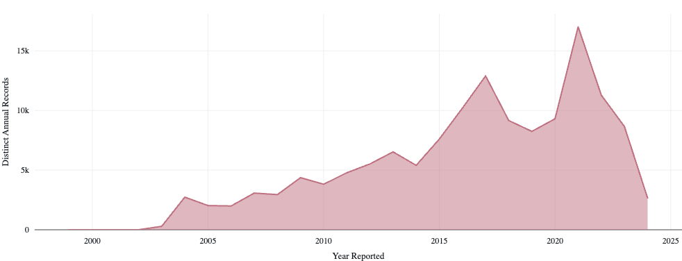
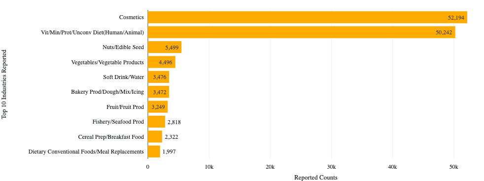
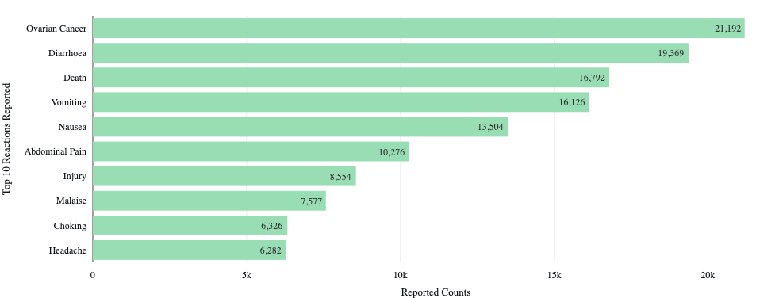

# FDA Adverse Food Event Data Engineering Pipeline (Azure End-to-End)

This project demonstrates an end-to-end data engineering solution using the Azure ecosystem to process and analyze openFDA's **[Adverse Food Event](https://open.fda.gov/apis/food/event/)** data, which is reported by consumers. The goal is to build a scalable pipeline that moves raw data through bronze, silver, and gold layers using a Lakehouse architecture, and visualize insights with Power BI.

---

## 🚀 Architecture Overview

Azure Data Factory → Azure Blob Storage - Bronze (JSON) → Azure Databricks ETL → Azure Blob Storage - Silver (Parquet) → Azure Synapse Analytics - Gold (Serverless SQL) → Power BI

## 🔧 Tools & Services Used

| Tool | Purpose |
|------|---------|
| **Azure Data Factory** | Ingest FDA adverse food event JSON data into Blob Storage |
| **Azure Blob Storage** | Store data at bronze and silver stages |
| **Azure Databricks** | Perform data cleaning, transformation, and conversion to Parquet |
| **Azure Synapse Analytics (Serverless SQL Pool)** | Query data using SQL for analysis and reporting |
| **Power BI** | Visualize insights from FDA data in dashboards and reports |

## 🏗️ Data Pipeline Stages

### 1. **Data Ingestion (Bronze Layer)**
- **Tool**: Azure Data Factory
- **Source**: FDA Adverse Food Event API
- **Format**: JSON
- **Destination**: Azure Blob Storage (Bronze Container)

### 2. **Data Transformation (Silver Layer)**
- **Tool**: Azure Databricks (PySpark)
- **Process**:
  - Read JSON files from Bronze
  - Clean and normalize data
  - Convert to **Parquet** format with **Snappy** compression
- **Destination**: Azure Blob Storage (Silver Container)

### 3. **Data Modeling (Gold Layer)**
- **Tool**: Azure Synapse Analytics (Serverless SQL Pool)
- **Process**:
  - Create external tables over Parquet files
  - Serve data to reporting tools using SQL endpoints
- **Destination**: Logical "Gold" layer via Synapse SQL queries

### 4. **Data Visualization**
- **Tool**: Power BI
- **Process**:
  - Connect Power BI to Synapse SQL Serverless endpoint
  - Build interactive reports and dashboards for insight into adverse food events

## 📊 Quick Insights

- Reporting frequency over time

- Top industries associated with adverse event reports

- Most reported symptoms

